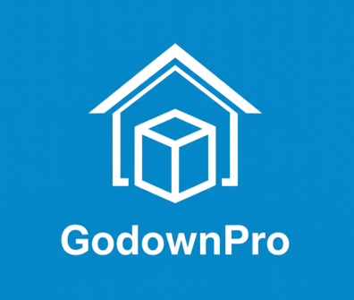

# GodownPro — The Architectural Ledger

> Precision-engineered inventory management for the modern construction site.

<p align="center">
  
</p>

---

## Overview

GodownPro is a Flutter-based construction material warehouse management app. It helps site engineers, warehouse managers, and office admins track materials, record transactions, and monitor stock values — all through a premium bilingual interface.

## Features

- **📊 Dashboard** — Hero stock value metric, quick stats, recent activity feed
- **📦 Inventory** — Add, view, and delete materials with category/unit/price tracking
- **🔄 Transactions** — Record incoming/outgoing stock movements with audit trail
- **⚙️ Settings** — Language, currency, appearance, and account management
- **🌐 Bilingual** — English primary + Arabic, Urdu, or Hindi secondary text on every label
- **💱 Multi-Currency** — AED, PKR, INR, USD with formatted display
- **📱 Responsive** — Mobile-first with tablet/desktop adaptive layouts

## Tech Stack

| Layer | Technology |
|---|---|
| Framework | Flutter (Dart ^3.10.4) |
| State Management | Riverpod (`flutter_riverpod`) |
| Routing | GoRouter (`go_router`) |
| Persistence | SharedPreferences (local JSON) |
| Typography | Google Fonts (Inter) |
| Design System | Material Design 3 — custom tonal tokens |

## Getting Started

```bash
# Clone and install dependencies
git clone <repo-url>
cd material_ledger
flutter pub get

# Run on connected device or simulator
flutter run
```

### Requirements
- Flutter SDK ^3.10.4
- iOS 12+ / Android API 21+

## Design Philosophy

This app follows **"The Architectural Ledger"** design system:

- **No borders** — depth via tonal surface layering, not 1px lines
- **No black** — all dark text uses `#191C1E`, never `#000000`
- **No shadows** — hierarchy through background color shifts
- **Bilingual everything** — every label shows English + secondary language
- **Generous whitespace** — "If you think there's enough padding, add 8px more"
- **48px min tap targets** — designed for industrial environments

See [`docs/design.md`](docs/design.md) for the full design specification.

## Project Structure

```
lib/
├── app/          # App root, router, shell navigation
├── core/         # Theme, design tokens, reusable widgets
├── features/     # Feature modules (onboarding, login, dashboard, inventory, transactions, settings)
└── shared/       # Data models, providers, translations
```

See [`docs/claude.md`](docs/claude.md) for the full architecture guide.

## Documentation

| Document | Contents |
|---|---|
| [`docs/claude.md`](docs/claude.md) | Architecture, state management, routing, conventions, implementation status |
| [`docs/design.md`](docs/design.md) | Visual design system — colors, typography, spacing, components, do's & don'ts |

## License

Private — All rights reserved. © 2024–2026 The Architectural Ledger.
