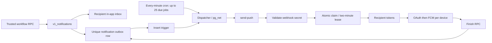

# Push P0 investigation — 29 September 2026

Status: initial investigation snapshot. The later
[local implementation](PUSH_P0_IMPLEMENTATION_20260929.md) supersedes the
implementation and test-status sections below. Production release gates remain
open.
No production containment, application mutation, migration, deployment, token
deletion or push test was performed. Unrelated local changes were preserved.

## A. Proven cause and remaining diagnostic blocker

Production `czykuksmlwswjsgotrpo` was inspected using aggregate SQL inside
read-only transactions, function definitions, and an Edge source download.
The deployed `send-push/index.ts` is byte-identical to the repository source.
See [source hash](evidence/push-p0-20260929/sender-source-verification.txt) and
[deployed SQL bodies](evidence/push-p0-20260929/production-function-definitions.json).

The amplification cause is proven: every failed job remains eligible forever.
The underlying Firebase error is **not known**. Production reads only
`error.status`, discards `error.details`, and replaces all non-token failures
with `FCM_SEND_FAILED`. Those original responses cannot be reconstructed from
the outbox. Do not label this as a VAPID, service-account or sender mismatch
without a structured response.

Dedicated staging `iqltcyimlqtcwyzlemwx` has `send-push` version 1 deployed,
251 pending jobs, and no `FCM_SERVICE_ACCOUNT_JSON` in its secret inventory.
Its present state cannot prove real FCM delivery. Required next input: an
operator-provisioned staging sender and an enrolled non-production test device,
or existing sanitized Firebase structured error evidence. Never paste keys or
tokens into chat. Quarantine the staging backlog before enabling transport.

## B. Current architecture

## C. Retry and concurrency defects

`v1_finish_notification_push` computes
`least(3600, 30 * 2 ^ least(attempt_count, 7))`. This caps the delay, not the
attempt count. After approximately one hour, a failed row becomes eligible
again, regardless of age or accumulated attempts. Hundreds of attempts over
weeks follow directly from this loop. Cron remains active every minute.

The finish function locks the row but checks neither active lease nor attempt
identity. A delayed failed response can overwrite a completed row. Dispatch
does not reserve an invocation before `net.http_post`; concurrent dispatchers
can enqueue duplicate Edge invocations even though claiming gates active sends.
Expired leases allow another sender while the old sender may still be running.
The Edge function ignores finish-RPC errors. Partial success marks the whole
job sent, losing individual-device failure state.

The HTTP `Retry-After` emitted by the Edge function does not schedule the next
attempt: SQL uses its own delay and does not read the HTTP response. FCM's own
`Retry-After` is also ignored. HTTP status must remain truthful in remediation.

## D. Implementation boundary

Only this investigation and sanitized source evidence were added. Runtime
implementation is held at the user's explicit “prove root cause, then
implement” boundary. No migration is represented as ready or tested.

Expected affected files: `supabase/functions/send-push/index.ts`, new transport
classification/tests beside it, one additive SQL migration, focused database
tests, and (after proving ownership behavior) `lib/shared/services/push_service.dart`
plus its tests. Routes, Accounts, inventory and MR workflow changes are not needed.

## E. Proposed failure taxonomy

Use the structured `google.firebase.fcm.v1.FcmError`, `google.rpc.BadRequest`
and `google.rpc.QuotaFailure` details. Persist an allowlisted category only.
Never persist response messages, tokens, credentials or raw response bodies.

| Category | Policy |
|---|---|
| Accepted by FCM | Complete device delivery; acceptance is not proof of OS display |
| No devices | Complete once; do not equate with successful push |
| Explicit UNREGISTERED | Terminal device; remove only that definitively stale token |
| Invalid token | Terminal only when structured evidence unambiguously identifies token invalidity |
| INVALID_ARGUMENT / bad payload | Terminal request; do not bulk-delete tokens |
| SENDER_ID_MISMATCH | Terminal for this sender/token combination; retain evidence and investigate project alignment |
| THIRD_PARTY_AUTH_ERROR | Configuration failure; degrade transport, retain tokens |
| OAuth/service-account authorization | Configuration failure; stop bulk sends and probe infrequently |
| QUOTA_EXCEEDED / 429 | Bounded retry, minimum 60 seconds, respect Retry-After |
| UNAVAILABLE / INTERNAL / appropriate 5xx | Bounded retry with backoff and jitter |
| Network/transport uncertainty | Distinguish known rejection from possibly accepted delivery; never blindly resend an ambiguous device |
| Unknown | Safe category, finite budget; never infer stale-token status |

Reference: [Firebase HTTP v1 error codes](https://firebase.google.com/docs/cloud-messaging/error-codes)
and [token management](https://firebase.google.com/docs/cloud-messaging/manage-tokens).

Proposed budget: six total attempts, at immediate, +1, +5, +15, +30 and +60
minutes, with positive jitter and the server honoring a longer Retry-After.
A 24-hour maximum age overrides retry scheduling. Define all limits in trusted
SQL, including registration requeue, expired leases, trigger and cron paths.
Retain historical counts above six; enforce the ceiling on future attempts
without falsifying historical evidence.

Use terminal state with completion time and reason; retain notification IDs,
attempts, created time, last attempt time and normalized failure. Use an
attempt UUID for claim/finish fencing and a durable per-device delivery ledger.
An expired attempt after a potentially accepted send must become
`delivery_unknown`, not automatically resend. This intentionally favors no
duplicate alert over guaranteed external push in the crash window; the in-app
notification remains authoritative. FCM acceptance and a database commit are
not one atomic transaction, so exactly-once external delivery cannot be claimed
from leases, notification tags or collapse identifiers alone.

Minimal circuit proposal: one protected transport-control row with operator
pause, open-until, normalized reason and a single probe lease. Open immediately
on a confirmed global credential/configuration error; suppress dispatch before
Edge invocation. Permit at most one recovery probe per 15 minutes, close only
after successful real transport evidence, and never replay stale jobs on close.

## F. Token lifecycle findings

Live inventory: 64 tokens, 11 users, all web; only five have `last_seen_at`
within 24 hours. Oldest last-seen is 4 September. This is registration recency,
not proof of device liveness or FCM validity.

Client refresh calls `_registerToken(newToken)`; the registration RPC upserts
by token and has no installation identifier or prior-token replacement. Repeat
registration of the same token does not create duplicates; rotation can leave
old rows behind. Browser profiles and installations can legitimately differ.
The present schema cannot establish which tokens share an installation or
which Firebase project issued them. Do not prune merely because a user has
7–14 tokens. Introduce owner-bound installation identity and atomic replacement,
with concurrent-tab/logout ownership tests, before claiming this is repaired.

Registration also requeues unseen `no_devices` jobs up to seven days old.
The remediation must close that stale-replay path, not only bound `failed`.

## G. Historical poison policy — proposed, not executed

At **2026-09-29 10:20:32 UTC**, a read-only count found:

| Failed jobs | Count |
|---|---:|
| Attempts >= 6 OR created more than 24 hours ago | 1,420 |
| Attempts < 6 AND created within 24 hours | 5 |

During a paused rollout, terminalize the first set without sending, preserving
every row and original count/error in migration evidence. Apply the same age
limit to pending/requeued work. Re-evaluate time-based counts at execution.
Do not automatically release the remaining five: first prove transport healthy,
then require unseen/currently authorized/still-actionable workflow state and
permit at most one controlled attempt within the global budget. Otherwise
terminalize them too. Never reopen historical terminal jobs after repair.

## H. Staging verification gate

All 13 requested delivery scenarios remain **not run**, not passed. Required:
valid web; multiple devices; unregistered token; permanent error; transient
backoff; exhausted budget; OAuth circuit; no devices; in-app with transport off;
concurrent workers; crash after acceptance; historical poison quarantine; and
new notifications during degradation. Include real devices for positive FCM
delivery and fault injection for failure/race paths. Mocks alone cannot prove
the transport works. Staging sender provisioning and a test device are missing.

## I. Consumption comparison

| Metric | Before / evidence | After |
|---|---|---|
| Edge invocations/hour | ~1,351.7 (user's six-hour sample) | Not measured; no remediation deployed |
| HTTP 503/hour | ~1,351.2 (same sample) | Not measured |
| Postgres rows/hour | ~155.5 (same sample) | Not measured |
| Visible Postgres payload/hour | ~0.09 MB (same sample; not billed ingestion) | Not measured |
| Edge/function log rows and bytes/hour | Not independently measured | Not measured |
| New outbox jobs/hour | 0 at 10:20 UTC; 47 over preceding 24h | Not measured |
| Failed outbox rows | 1,425, live verified | Unchanged by this investigation |
| Failed attempts min/average/max | 5 / 307.1 / 605, live verified | Not measured |
| Sent / no_devices rows | 0 / 2,845, live verified | Not measured |
| Attempts/sends/retries/terminal events per hour | Existing rows do not retain a complete attempt time series | New ledger required |
| Billing-cycle ingestion/query | 201.136 GB / 95.9 GB, dashboard verified | Historical counters will not decrease |

Do not attribute all 201 GB to push from this evidence. Compare equal windows
after release, normalized by real notifications and active devices.

## J. Low-cost monitoring design

Implement a protected service-role/operator health RPC over operational tables,
not raw logs. Deny anon/ordinary authenticated access, test exact positive and
negative permissions, return no user identifiers or token material. Index
notification creation, current due jobs, terminal/completion timestamps and
attempt timestamps. Keep historical event aggregates in hourly buckets so
the routine read examines 24 bounded buckets rather than the full ledger.

Expose 1h/24h notification creation, FCM acceptance, no-device completions,
retrying and terminal counts; accepted-device/attempted-device percentage with
denominator; current max attempts, oldest retry, latest successful acceptance,
normalized error counts, token/user totals, pause/circuit/probe state and cron
last run. Add cheap outbox lag and failed-worker counts only; avoid business
table joins for routine infrastructure health.

PostHog remains the client adoption/failure/latency/release source. Database
audit tables remain the business activity source. Raw Supabase logs are only
for incidents: minutes, exact source/path/function/SQLSTATE filters,
server-side aggregation, no full attributes unless necessary, and no polling
or routine repeated 24-hour scans.

## K. Containment and rollout

The [operator containment SQL](evidence/push-p0-20260929/containment-operator-only.sql)
is prepared, **not executed**, and requires explicit production approval.
It reversibly hides the dispatcher URL, disables only push cron, and revokes
the sender's claim permission. The insert trigger remains: authoritative
notifications and outbox rows continue. Already claimed/in-flight sends may
finish; containment cannot retract an accepted push. Do not remove the FCM
credential as containment: existing code turns that into more retryable errors.

Rollout order after root-cause proof and staging acceptance:

1. Review exact isolated candidate and pending rows; record deployed definitions
   and grants. Do not run broad `db push` from this dirty checkout.
2. Obtain approval and contain production; let in-flight work drain.
3. Apply reviewed additive migration with transport paused; terminalize poison
   jobs; install bounded dispatcher, fenced claims/finishes, circuit and health
   projection. Deny unsafe legacy finish entrypoints.
4. Deploy compatible Edge sender; configure verified sender privately.
5. Prove one designated recent test notification, then controlled recovery;
   re-enable only reviewed eligible work. Verify OS display separately from FCM
   acceptance. Compare health projection and narrow incident samples.
6. Roll back by pausing transport and retaining all new ledger/history. Do not
   restore the old unbounded worker or reopen terminal rows. In-app delivery
   remains available throughout.

## Previous draft conflict and local validation

Production retains `v1_raise_version_conflict`: REST callers get non-retryable
HTTP 409 via `PGRST`, while the response body preserves `40001`; direct SQL
retains genuine conflict behavior. The wrapper delegates to the draft command.
The deployed draft command calls this helper and contains no literal `40001`,
verified by a separate read-only function-body query.
This source inspection does not prove zero recent production errors or a
successful normal-use/concurrent-conflict test. No draft code was changed.
The supplied six-hour zero-40001 observation remains user-provided evidence.

`git diff --check` passed during investigation. Flutter/Dart, database reset,
pgTAP, web/APK builds and device tests were not run: no runtime change was made,
and the requested root-cause/staging prerequisites remain unresolved. Existing
unrelated dirty files were not formatted, committed, reset or deployed.
